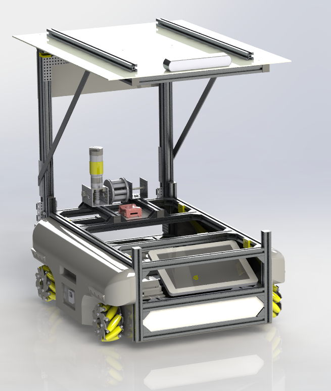

# Programme d'interface et du serveur du projet Heron




## **Installation**
---------------------------------------------------------------------------------------------------
### **Côté Serveur**
#### *Prérequis*

L'ensemble des programmes a été rédigé en supposant que :
- L'IP du server est 10.224.0.53
- Son port 22322 est libre (connection TCP)

* Les scripts devront être adaptés si ces conditions ne sont pas vérifiées.

| Prérequis | Source |
| ------ | ------ |
| MySQL | https://gist.github.com/arsho/ed4c2488714d9ad5629d4abc02a62eaa |
| MySQL-Connector-Python | https://github.com/mysql/mysql-connector-python |

#### *Création de la base de données heronDatabase*

- **Première solution**

On ouvre une instance MySQL (on peut séléctionner un autre utilisateur que root)
```sh
mysql -u root -p
```
Puis dans cette instance
```MYSQL
CREATE DATABASE heronDatabase;
```
- **Seconde solution**

Directement depuis le terminale
```sh
mysql -u utilisateur -password 'votreMotDePasse' -e 'CREATE DATABASE heronDatabase;'
```
#### *Initialisation de la base de données heronDatabase*

Nous allons avoir besoin des tables suivantes :

**Table AVAILABLE**

| Champs         | Type     | Null | Key | Default | Extra |
| ------ | ------ | ------ | ------ | ------ | ------ |
| **availableLine** | int(11)  | NO   | PRI | NULL    | auto_increment |
| **ID**            | tinytext | NO  |     | NULL    |                |
| **Status**        | tinytext | NO   |     | NULL    |                |
| **ComAvailable**  | tinytext | YES  |     | NULL    |                |


**Table COMMANDS**

| Champs         | Type     | Null | Key | Default | Extra |
| ---------------- | ---------- | ------ | ----- | --------- | ---------------- |
| **LineOrder** | int(10)  | NO   | PRI | NULL    | auto_increment |
| **OrderID**            | tinytext | NO  |     | NULL    |                |
| **Function**        | tinytext | NO   |     | NULL    |                |
| **Target**  | tinytext | NO  |     | NULL    |                |
| **Status**  | tinytext | NO  |     | NULL    |                |
| **Source**  | tinytext | NO  |     | NULL    |                |
| **ComOrder**  | text | YES  |     | NULL    |                |


**Table DICTIONNARY**

| Champs         | Type     | Null | Key | Default | Extra          |
| ---------------- | ---------- | ------ | ----- | --------- | ---------------- |
| **DictionnaryLine** | int(11)  | NO   | PRI | NULL    | auto_increment |
| **ID**            | tinytext | NO  |     | NULL    |                |
| **Function**        | tinytext | NO   |     | NULL    |                |
| **ShortDescription**  | tinytext | NO  |     | NULL    |                |
| **LongDescription**  | text | YES  |     | NULL    |                |

Les commands pour mettre en place ces tables sont :

*AVAILABLE*
```sh
CREATE TABLE `AVAILABLE` (
	`availableLine` INT(11) NOT NULL AUTO_INCREMENT,
	`ID` TINYTEXT NOT NULL DEFAULT NULL,
	`Status` TINYTEXT NOT NULL DEFAULT NULL,
	`ComAvailable` TINYTEXT DEFAULT NULL,
	PRIMARY KEY (`availableLine`)
);
```

*COMMANDS*
```sh
CREATE TABLE `COMMANDS` (
	`LineOrder` INT(10) NOT NULL AUTO_INCREMENT,
	`OrderID` TINYTEXT NOT NULL DEFAULT NULL,
	`Function` TINYTEXT NOT NULL DEFAULT NULL,
	`Target` TINYTEXT NOT NULL DEFAULT NULL,
	`Status` TINYTEXT NOT NULL DEFAULT NULL,
	`Source` TINYTEXT NOT NULL DEFAULT NULL,
	`ComOrder` TINYTEXT DEFAULT NULL,
	PRIMARY KEY (`LineOrder`)
);

*DICTIONNARY*
```sh
CREATE TABLE `DICTIONNARY` (
	`DictionnaryLine` INT(11) NOT NULL AUTO_INCREMENT,
	`ID` TINYTEXT NOT NULL DEFAULT NULL,
	`Function` TINYTEXT NOT NULL DEFAULT NULL,
	`ShortDescription` TINYTEXT NOT NULL DEFAULT NULL,
	`LongDescription` TINYTEXT DEFAULT NULL,
	PRIMARY KEY (`DictionnaryLine`)
);


```
*Remarque :*

Utiliser si besoin 
```sh
USE heronDatabase;
```
### **Côté Client**
### **Utilisation de notre client**
#### *Prérequis*

Assuré vous d'avoir placé dans un dossier, à sa racine, ce repo et le fichier Guess.txt permettant d'initialiser la connection.

## Utilisation
---------------------------------------------------------------------------------------------------
### **Côté Serveur**
Dans un même dossier, placer le fichier Guess.txt contenant la phrase de passe ainsi que ce repo.
Executé le programme server.py
Executer donc :
```sh
python server.py
```

*Le script de server.py a été commenté de manière à vous guider si vous ne souhaitez pas utiliser la couche* d'authentification.

### **Côté Client**
Configurez le répertoire de la même manière que pour server.py.
Donner en argument l'ID souhaité.
```sh
python client.py LeNomDeMonSuperRobot
```
Vous pouvez récupérer grâce à notre client l'ID exacte qui serat attribué à votre robot.
En effet, chaque ID demandé est toujours accepté mais est également suivit d'un index.
C'est à dire que python client.py NomRobot donnera pour ID à votre robot un id de la forme :
NomRobot-xx
Avec xx un entier supérieur ou égale à 1.

---------------------------------------------------------------------------------------------------

